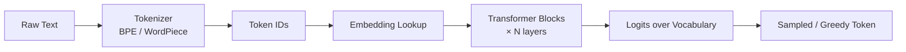
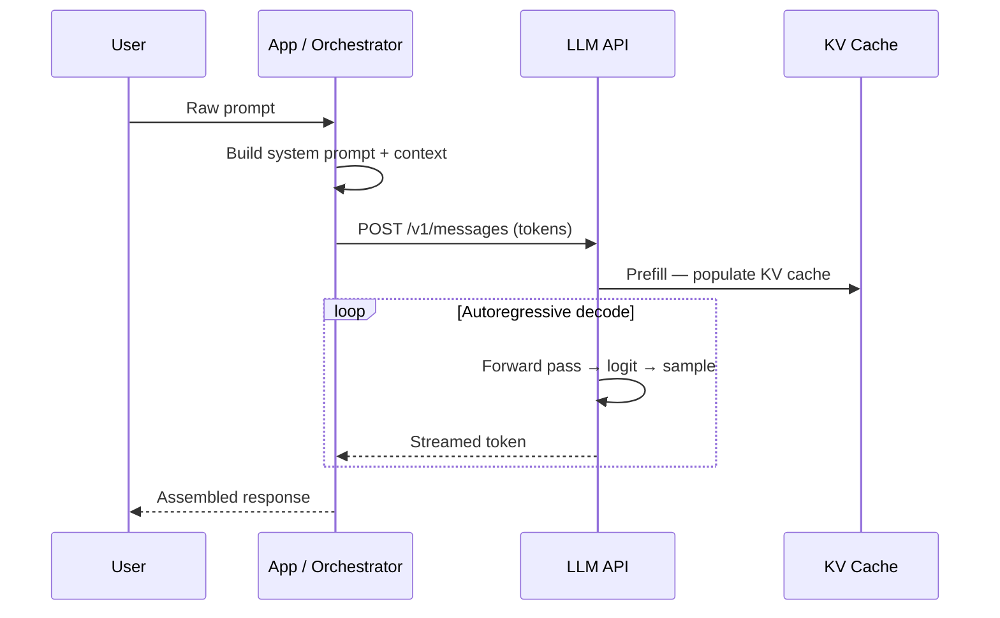

# Foundations & Core Concepts

> **Summary:** A structured reference covering the essential building blocks of Large Language Models — from internal architecture and semantic representations to the end-to-end inference pipeline. Designed for engineers and researchers building on top of LLMs.

---

## Overview

Understanding LLMs from the ground up requires three layers of knowledge: **how models work internally**, **how meaning is encoded and retrieved**, and **how inference flows from prompt to output**. This document maps all three.

---

## 1. LLM Fundamentals

> **ℹ️ Info:** These concepts form the non-negotiable baseline for anyone working with language models at any depth.

### 1.1 LLM Internals

- **LLM internals** — The weights, layers, and forward-pass mechanics that turn input tokens into probability distributions over the next token.
- **Transformer architecture** — A stack of encoder/decoder blocks using self-attention and feed-forward layers; the backbone of every modern LLM.
- **Attention mechanisms** — Learned, dynamic weighting that lets each token "look at" every other token to build contextual representations.
- **Tokenization deep dive** — The process of converting raw text into integer IDs via vocabularies (BPE, WordPiece, SentencePiece) before any model computation begins.

<details>
<summary>🔍 Deep Dive: Transformer Block Walkthrough</summary>

Each Transformer block applies the following in sequence:

1. **Layer Norm** → stabilise activations before attention
2. **Multi-Head Self-Attention** → compute Q, K, V projections; scale dot-product; softmax
3. **Residual Add** → add input back to attention output
4. **Layer Norm** → second normalisation
5. **Feed-Forward Network (FFN)** → two linear layers with a non-linearity (GELU/ReLU)
6. **Residual Add** → add pre-FFN input back

```python
import torch
import torch.nn as nn

class TransformerBlock(nn.Module):
    def __init__(self, d_model, n_heads, ffn_dim):
        super().__init__()
        self.attn = nn.MultiheadAttention(d_model, n_heads, batch_first=True)
        self.ffn  = nn.Sequential(
            nn.Linear(d_model, ffn_dim),
            nn.GELU(),
            nn.Linear(ffn_dim, d_model),
        )
        self.norm1 = nn.LayerNorm(d_model)
        self.norm2 = nn.LayerNorm(d_model)

    def forward(self, x):
        attn_out, _ = self.attn(x, x, x)
        x = self.norm1(x + attn_out)          # residual + norm
        x = self.norm2(x + self.ffn(x))       # residual + norm
        return x
```

</details>

---

### Attention Mechanism — Scaled Dot-Product

```python
import torch
import torch.nn.functional as F

def scaled_dot_product_attention(Q, K, V, mask=None):
    """
    Q, K, V : (batch, heads, seq_len, d_k)
    """
    d_k = Q.size(-1)
    scores = torch.matmul(Q, K.transpose(-2, -1)) / (d_k ** 0.5)  # scale
    if mask is not None:
        scores = scores.masked_fill(mask == 0, float('-inf'))
    weights = F.softmax(scores, dim=-1)                             # attend
    return torch.matmul(weights, V), weights                        # context
```

---

### Tokenization

```python
from transformers import AutoTokenizer

tokenizer = AutoTokenizer.from_pretrained("meta-llama/Meta-Llama-3-8B")

text   = "Tokenization converts text → integer IDs."
tokens = tokenizer(text, return_tensors="pt")

print(tokens["input_ids"])          # tensor of token IDs
print(tokenizer.convert_ids_to_tokens(tokens["input_ids"][0]))
```

> **⚠️ Warning:** Token boundaries do **not** align with word boundaries. "tokenization" may split into `["token", "ization"]`. Always measure cost in tokens, not words.

---



---

## 2. Representation & Semantics

> **ℹ️ Info:** How meaning is encoded into numerical space — the foundation of semantic search and retrieval-augmented systems.

### 2.1 Core Concepts

- **Embeddings and vector spaces** — Dense, high-dimensional float vectors that encode semantic meaning; geometrically close vectors imply semantically similar content.
- **Semantic similarity** — Measured via cosine similarity or dot product between embedding vectors; enables fuzzy, meaning-aware matching beyond keyword overlap.
- **Vector representations in retrieval** — Documents and queries are embedded into the same space; nearest-neighbour search (ANN) fetches the most relevant chunks at query time.

<details>
<summary>🔍 Deep Dive: Cosine Similarity vs Dot Product</summary>

| Metric             | Formula                   | Use When                        |
| ------------------ | ------------------------- | ------------------------------- |
| Cosine Similarity  | `cos(θ) = A·B / (‖A‖‖B‖)` | Vectors not L2-normalised       |
| Dot Product        | `A · B`                   | Vectors pre-normalised (faster) |
| Euclidean Distance | `‖A − B‖`                 | Density-sensitive clustering    |

Most embedding models (e.g. `text-embedding-3-small`) output L2-normalised vectors — use dot product for speed.

</details>

```python
from sentence_transformers import SentenceTransformer
import numpy as np

model = SentenceTransformer("all-MiniLM-L6-v2")

docs  = ["Transformers use attention.", "Embeddings encode meaning."]
query = "How does attention work?"

doc_embeds   = model.encode(docs,  normalize_embeddings=True)
query_embed  = model.encode([query], normalize_embeddings=True)

scores = np.dot(doc_embeds, query_embed.T).flatten()   # cosine via dot (L2-norm)
ranked = sorted(zip(scores, docs), reverse=True)

for score, doc in ranked:
    print(f"{score:.3f}  {doc}")
```

---

## 3. Inference Pipeline

> **ℹ️ Info:** Tracing the full journey from user prompt to final output — and where latency, cost, and quality decisions live.

### 3.1 Core Concepts

- **End-to-end inference flow** — The sequential path: tokenise → embed → forward-pass through all layers → decode logits → detokenise → return text.
- **Prompt → model → output lifecycle** — Includes system prompt assembly, context window packing, KV-cache population, autoregressive decoding, and stop-sequence detection.
- **Latency vs quality tradeoffs** — Larger models and longer outputs increase quality but raise TTFT (Time To First Token) and cost; sampling parameters (temperature, top-p) modulate quality/diversity.

---



---

### Inference with Streaming

```python
import anthropic

client = anthropic.Anthropic()

with client.messages.stream(
    model="claude-sonnet-4-20250514",
    max_tokens=512,
    messages=[{"role": "user", "content": "Explain attention mechanisms briefly."}],
) as stream:
    for text_chunk in stream.text_stream:
        print(text_chunk, end="", flush=True)   # TTFT-aware streaming
```

### Latency vs Quality Levers

| Lever          | ↓ Latency        | ↑ Quality      |
| -------------- | ---------------- | -------------- |
| Model size     | Smaller (Haiku)  | Larger (Opus)  |
| `max_tokens`   | Lower            | Higher         |
| `temperature`  | 0 (greedy)       | 0.7–1.0        |
| Context length | Shorter prompt   | Longer context |
| Streaming      | Perceived faster | No change      |

> **💡 Tip:** For production RAG pipelines, use a small model for retrieval-grounding and a larger model only for final synthesis — best of both worlds.

> **🚫 Danger:** Hitting the context window limit truncates silently in some APIs. Always track token counts explicitly before sending.

---

## Key Takeaways

1. **Transformers** are composed of attention + FFN blocks repeated N times; attention is where context is built.
2. **Tokenization** is pre-model and determines cost, context fit, and edge-case behaviour.
3. **Embeddings** compress semantics into vectors; cosine/dot-product similarity powers retrieval.
4. **Inference is autoregressive** — one token at a time, fed back into the model; KV cache avoids recomputing past context.
5. **Latency and quality trade against each other** — instrument both before optimising.

---

## RAG Metadata

```yaml
category: LLM Fundamentals
tags:
  - transformers
  - attention
  - tokenization
  - embeddings
  - vector-search
  - inference
  - semantic-similarity
  - kv-cache
difficulty: Intermediate
chunk_strategy: section # split at H2/H3 boundaries
retrieval_hints:
  - "how does attention work"
  - "what is tokenization"
  - "embeddings vs tokens"
  - "inference latency tradeoffs"
  - "end to end LLM pipeline"
last_updated: 2025-06
```
