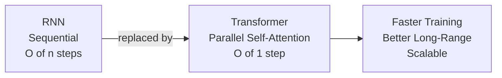
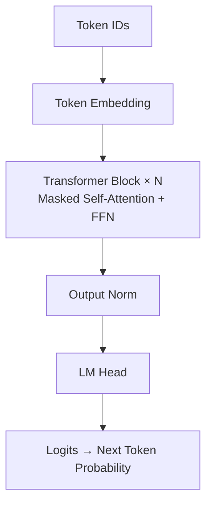
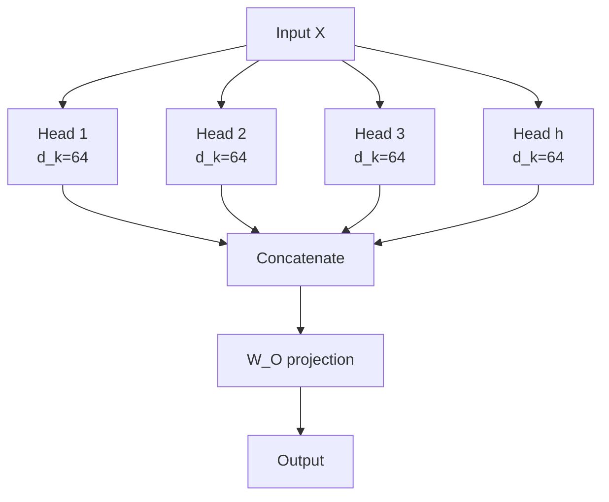
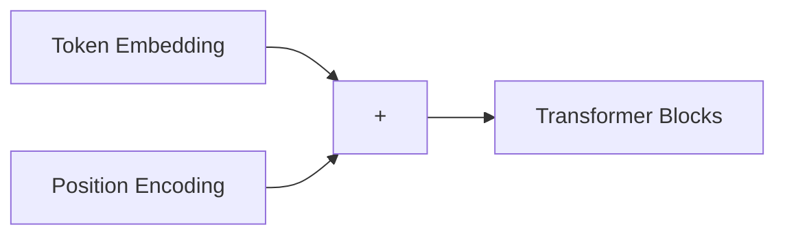
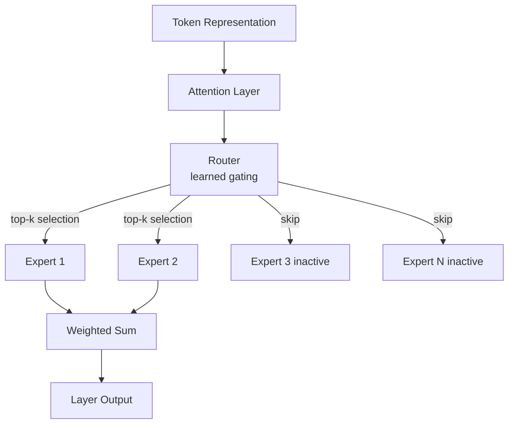
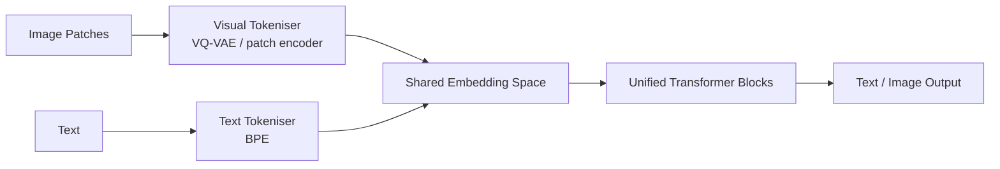
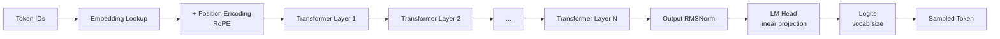

# LLM Internals

> **ℹ️ Info** **Summary:** A deep-dive into how large language models are built - covering the Transformer architecture, attention mechanisms, position encodings, feed-forward networks, and modern efficiency innovations like MoE and GQA. Essential reading before building any production AI system.


## Overview

Every LLM you interact with - GPT-4, Claude, Llama - is a stack of Transformer blocks. Think of a Transformer block like a floor in a building: raw material (your text) goes in at the bottom, gets processed at each floor, and by the top floor the model has "understood" enough to predict what word comes next.

Understanding what lives inside those blocks helps you make smarter decisions: choosing the right model size, estimating memory costs, debugging generation issues, and knowing when architectural tradeoffs matter.

This document walks you from the original Transformer paper (2017) all the way to the frontier model designs of 2025.

---

## 1. The Transformer Revolution

Before 2017, sequence modeling relied on **RNNs and LSTMs** - architectures that processed tokens one at a time, left to right. Think of an RNN like a person reading a book one word at a time, updating their memory after each word. This created two hard problems:

- **Slow training** - Sequential processing meant no parallelisation. You had to wait for token N before computing token N+1. Like a single cashier at a supermarket — the whole queue is blocked until each person is done.
- **Vanishing long-range dependencies** - Information had to travel through dozens of hidden states to connect distant tokens. By the time it arrived, it was diluted or lost. Like a game of telephone — the message at the end barely resembles what was said at the start.

The Transformer (Vaswani et al., "Attention Is All You Need", 2017) replaced recurrence entirely with **self-attention** - letting every token directly attend to every other token in one parallel operation. Imagine instead of one cashier, every item in your cart could simultaneously talk to every other item and decide together what matters.

> **💡 Tip** **Mental model for engineers:** Think of RNNs as a single-threaded request pipeline where each step blocks on the previous. Self-attention is like a fully connected graph - every node queries every other node simultaneously, in parallel.



---

## 2. Architecture Variants

Three families emerged from the original Transformer, depending on which components they keep. Think of these like three different types of readers: one who reads the whole page before answering (encoder-only), one who reads and writes at the same time (decoder-only), and one who reads fully first then writes (encoder-decoder).

| Architecture    | Attention Type         | Examples             | Best For                        |
| --------------- | ---------------------- | -------------------- | ------------------------------- |
| Encoder-only    | Bidirectional          | BERT, RoBERTa        | Classification, NER, embeddings |
| Decoder-only    | Causal (left-to-right) | GPT-4, Claude, Llama | Text generation, chat           |
| Encoder-Decoder | Cross-attention        | T5, BART             | Translation, summarisation      |

### Decoder-Only - Why It Dominates

Most modern LLMs are decoder-only. Each token can only attend to tokens that came before it (causal masking — like blinders that only let you see what's already been written). This aligns perfectly with the training objective: predict the next token. It's like an autocomplete that has read trillions of sentences and learned what word naturally follows.



**Why decoder-only wins:**

- Simplest architecture - easier to scale
- Pre-training objective (next token prediction) naturally aligns with generation tasks
- Scales well with compute - every doubling of parameters gives measurable gains

### Encoder-Only - Understanding Tasks

BERT-style models use **bidirectional attention** - every token sees every other token, past and future. They cannot generate text autoregressively, but they excel at tasks that require understanding the full context. Think of it as reading an entire sentence before deciding what each word means — great for comprehension, not for writing.

**When to use encoder-only:**

- Intent classification and sentiment analysis
- Named entity recognition (NER)
- Backbone for dense embedding models (e.g. sentence-transformers)
- Smaller and faster than decoder-only for specific tasks

### Encoder-Decoder - The Return

While decoder-only dominated for years, 2025 has seen a resurgence of encoder-decoder architectures for specialised **reasoning and verification** tasks. Internal verifiers in models like o3 use encoder components to check the decoder's output - essentially a judge model architecture. Think of it as one person writing an essay and another person fact-checking it — two specialised roles working together.

> **ℹ️ Info** The encoder reads the full problem context with bidirectional attention, then the decoder generates a solution conditioned on that rich encoding. This two-stage approach gives stronger reasoning at the cost of higher complexity.

---

## 3. Self-Attention Mechanism

Self-attention is the engine of every Transformer. It lets each token "ask questions" of every other token and gather relevant information. If tokens were people in a meeting, self-attention is what lets everyone shout out "who here is relevant to my question?" and vote on who to listen to.

### The Intuition

Consider: _"The animal didn't cross the street because **it** was too tired."_

What does "it" refer to? Humans instantly know it's the animal, not the street. Self-attention learns this by computing a **relevance score** between every pair of tokens - "it" scores high similarity with "animal" and low with "street". The model learns through billions of examples which words belong together.

### The Math

For an input sequence **X** of n tokens, each with dimension d:

```
Q = X × W_Q    →  "What am I looking for?"      (the question each token asks)
K = X × W_K    →  "What information do I contain?"  (the label each token wears)
V = X × W_V    →  "What do I actually contribute?"  (the actual content to share)

Attention(Q, K, V) = softmax( QKᵀ / √d_k ) × V
```

Think of it like a library: Q is your search query, K is the index/title of each book, and V is the actual content inside the books. You compare your query to all the titles, pick the most relevant ones, then blend their content together based on how relevant they are.

**Step-by-step breakdown:**

1. **QKᵀ** - Dot product between every query and every key. Produces an n×n similarity matrix. (How much does each token's question match each token's label?)
2. **÷ √d_k** - Scale down to prevent large values from saturating softmax. (Keeps the numbers well-behaved — see below.)
3. **softmax(·)** - Convert scores to probabilities. Each row sums to 1. (Turn raw scores into "how much attention to pay" — all weights add up to 100%.)
4. **× V** - Take a weighted sum of values. High-attention tokens contribute more. (Blend the content together, weighted by relevance.)

```python
import numpy as np

def scaled_dot_product_attention(Q, K, V, mask=None):
    """
    Q, K, V: shape (batch, heads, seq_len, d_k)
    """
    d_k = Q.shape[-1]

    # Step 1: similarity scores
    scores = Q @ K.transpose(-2, -1) / np.sqrt(d_k)

    # Step 2: apply causal mask (decoder-only)
    if mask is not None:
        scores = scores.masked_fill(mask == 0, float('-inf'))

    # Step 3: softmax → attention weights
    weights = np.exp(scores) / np.exp(scores).sum(axis=-1, keepdims=True)

    # Step 4: weighted sum of values
    return weights @ V, weights
```

### Why Scale by √d_k?

> **⚠️ Warning** This is a favourite interview question - it tests numerical stability intuition.

As dimension d grows, raw dot products grow in magnitude proportionally to √d. Imagine turning up a volume dial so high the speaker distorts — large values push softmax into **saturated regions** where gradients become nearly zero and training stalls. Dividing by √d_k turns the volume back down to a safe level.

```python
import numpy as np

d = 512
q = np.random.randn(d)
k = np.random.randn(d)

raw_dot    = np.dot(q, k)           # magnitude ≈ √512 ≈ 22.6  → saturates softmax
scaled_dot = raw_dot / np.sqrt(d)   # magnitude ≈ 1.0          → stable gradients

print(f"Raw dot product:    {raw_dot:.2f}")
print(f"Scaled dot product: {scaled_dot:.2f}")
```

### Attention Complexity

| Operation        | Time Complexity | Space Complexity |
| ---------------- | --------------- | ---------------- |
| QKᵀ computation  | O(n²d)          | O(n²)            |
| Softmax          | O(n²)           | O(n²)            |
| Weighted sum × V | O(n²d)          | O(nd)            |

The **O(n²)** bottleneck is the central challenge for long contexts. Every time you double the sequence length, computation quadruples. A 100K token context window requires 10 billion attention computations per layer, per forward pass — that's why long contexts are expensive.

<details>
<summary>🔍 Deep Dive: Efficient Attention Alternatives</summary>

Several approaches tackle the O(n²) problem:

| Method                            | Complexity                 | Tradeoff                             |
| --------------------------------- | -------------------------- | ------------------------------------ |
| **Sparse Attention** (Longformer) | O(n)                       | Local + global patterns only         |
| **Linear Attention** (Performer)  | O(n)                       | Approximation via random features    |
| **Flash Attention**               | O(n²) compute, O(n) memory | Kernel fusion - same math, less VRAM |
| **State Space Models** (Mamba)    | O(n)                       | No pairwise interactions             |

Flash Attention is the most widely adopted - it doesn't change the math but rewrites the CUDA kernel to avoid materialising the full n×n matrix in HBM, dramatically reducing memory bandwidth. Think of it as doing the same calculation but using scratch paper instead of a whiteboard — same answer, far less space used.

```python
# Flash Attention (via PyTorch 2.0+)
import torch
import torch.nn.functional as F

# Automatically uses Flash Attention when available
output = F.scaled_dot_product_attention(Q, K, V, is_causal=True)
```

The tradeoff: O(n²) is necessary for **full** long-range dependencies. Most tasks don't need all pairwise interactions - sparse and linear methods trade correctness for speed.

</details>

---

## 4. Multi-Head Attention

Instead of one attention operation, modern Transformers run **h parallel attention heads** - each in a lower-dimensional subspace. If self-attention is like one person reading a text and highlighting what's important, multi-head attention is like h different experts reading the same text, each highlighting different things (grammar, facts, tone), then combining their notes.



**Why multiple heads?**

- Different heads specialise - one might track syntax (grammatical relationships), another coreference (what "it" refers to), another long-range semantics (thematic connections across paragraphs)
- Similar to ensemble methods: multiple perspectives improve robustness
- Processing is parallel across heads - no extra latency

**Typical configurations:**

- GPT-3 175B: 96 heads × 128 dimensions = 12,288 total
- Llama 2 70B: 64 heads × 128 dimensions = 8,192 total

```python
import torch
import torch.nn as nn

class MultiHeadAttention(nn.Module):
    def __init__(self, d_model, n_heads):
        super().__init__()
        assert d_model % n_heads == 0
        self.d_k    = d_model // n_heads
        self.n_heads = n_heads
        self.W_q = nn.Linear(d_model, d_model)
        self.W_k = nn.Linear(d_model, d_model)
        self.W_v = nn.Linear(d_model, d_model)
        self.W_o = nn.Linear(d_model, d_model)

    def forward(self, x, mask=None):
        B, T, C = x.shape
        # Project and split into heads
        Q = self.W_q(x).view(B, T, self.n_heads, self.d_k).transpose(1, 2)
        K = self.W_k(x).view(B, T, self.n_heads, self.d_k).transpose(1, 2)
        V = self.W_v(x).view(B, T, self.n_heads, self.d_k).transpose(1, 2)
        # Scaled dot-product attention
        out = torch.nn.functional.scaled_dot_product_attention(Q, K, V, is_causal=True)
        # Merge heads and project
        out = out.transpose(1, 2).contiguous().view(B, T, C)
        return self.W_o(out)
```

### Grouped Query Attention (GQA)

Standard MHA stores separate K and V tensors for every head in the KV cache. For a 70B model at long context, this becomes the **dominant memory cost**. GQA shares K and V across groups of query heads — like having multiple analysts (Q heads) but only one shared filing cabinet (K,V) per group instead of one per analyst.

| Attention Type      | K,V per Query | KV Cache Reduction | Used In          |
| ------------------- | ------------- | ------------------ | ---------------- |
| Multi-Head (MHA)    | 1:1           | Baseline           | GPT-3            |
| Grouped-Query (GQA) | 8:1 typical   | ~8×                | Llama 2, Mistral |
| Multi-Query (MQA)   | All:1         | ~n_heads×          | PaLM, Falcon     |

**Concrete impact - Llama 2 70B at 8K context:**

- MHA KV cache: ~10 GB per request
- GQA KV cache: ~1.3 GB per request

This ~8× reduction directly multiplies your achievable batch size and therefore throughput. Fewer filing cabinets = more room in the office = more users you can serve simultaneously.

> **💡 Tip** GQA is the sweet spot. MQA reduces quality noticeably; MHA is too expensive. Most production models in 2025 use GQA with G=8.

<details>
<summary>🔍 Deep Dive: The KV Cache Explained</summary>

During autoregressive generation, you produce one token at a time. Without caching, you'd recompute K and V for all previous tokens on every step - O(n) extra work per token. This is like re-reading the entire conversation from the beginning every time you want to say the next word.

The **KV cache** stores the K and V tensors from all past positions. On each new token:

1. Compute Q, K, V for the **new position only**
2. Append new K, V to the cache
3. Run attention with the full cached K, V

This reduces per-step K/V computation from O(n) to O(1). You only read the new word; you've already saved what the old ones said.

**The cost:** Cache size grows linearly with sequence length.

```
KV Cache size = 2 × n_layers × n_kv_heads × d_head × seq_len × bytes_per_element

Llama 2 70B (GQA, 8 KV heads):
= 2 × 80 × 8 × 128 × 8192 × 2 bytes
= ~1.3 GB per request at 8K context
```

At scale, KV cache management (eviction, paging, prefix caching) is one of the most important serving engineering challenges. See **vLLM's PagedAttention** for the state-of-the-art solution.

</details>

---

## 5. Position Encodings

Self-attention is **permutation-invariant** - without explicit position information, "dog bites man" and "man bites dog" produce identical representations. Order doesn't exist by default — it has to be injected. Position encodings are like numbering the seats in a cinema so everyone knows where they're sitting relative to the screen.



### Sinusoidal (Original Transformer)

Uses deterministic sine and cosine functions at different frequencies — like assigning each position a unique fingerprint made of waves:

```
PE(pos, 2i)   = sin(pos / 10000^(2i/d))
PE(pos, 2i+1) = cos(pos / 10000^(2i/d))
```

- No learned parameters
- Theoretically extrapolates - practically doesn't
- Rarely used today

### Learned Absolute

A simple embedding table: one vector per position, trained end-to-end. Like giving each seat in the cinema its own unique colour — the model memorises what each colour means.

```python
position_embeddings = nn.Embedding(max_seq_length, d_model)
x = token_embeddings + position_embeddings(positions)
```

- Simple and effective
- Hard cap at training length - cannot generalise to longer sequences (if you only trained on 1,024 seats, seat 1,025 is a mystery)
- Used in GPT-2, early BERT

### RoPE - Rotary Position Embedding

Instead of adding position to token embeddings, RoPE **rotates** the Q and K vectors by an angle proportional to position before computing attention scores. Think of it like a clock — the angle between two hands tells you how far apart they are, regardless of where they started.

```
RoPE(x, pos) = x × cos(pos × θ) + rotate_half(x) × sin(pos × θ)
```

**Why RoPE is dominant (Llama, Mistral, PaLM):**

- Encodes **relative** position - attention score depends on (pos_q − pos_k), not absolute values. The model cares about _how far apart_ two tokens are, not _exactly where_ they are.
- Extrapolates better than absolute encodings
- Can be extended at inference time (YaRN, LongRoPE for 128K+ context)

### ALiBi - Attention with Linear Biases

Adds a position-dependent penalty directly to attention scores — like a tax on long-distance relationships. The farther away a token is, the more its attention score gets penalised.

```
Attention = softmax( QKᵀ / √d_k  −  m × |pos_q − pos_k| )
```

Where m is a head-specific slope. Farther-away tokens get a larger negative bias.

- No embedding changes - clean implementation
- Best extrapolation of all methods
- Used in BLOOM, MPT

### Comparison

| Method           | Extrapolation | Compute Overhead | Modern Usage |
| ---------------- | ------------- | ---------------- | ------------ |
| Sinusoidal       | Poor          | None             | Rarely       |
| Learned Absolute | None          | Minimal          | Legacy       |
| RoPE             | Good          | ~5%              | Most LLMs    |
| ALiBi            | Excellent     | ~2%              | Some LLMs    |

> **ℹ️ Info** For most new projects, use RoPE. It has the widest ecosystem support and the best balance of quality, extrapolation, and implementation simplicity.

---

## 6. Feed-Forward Networks (FFN)

After attention, each token passes through a **position-wise feed-forward network** - two linear layers with a non-linearity in between. This is where ~2/3 of a layer's parameters live.

Think of attention as the meeting where everyone shares what they know. The FFN is the desk work that each person does alone afterward — processing and integrating what they heard into their own understanding. It's where the model's factual knowledge is believed to be stored.

```python
def feed_forward(x, W1, W2):
    hidden = activation(x @ W1)   # Expand:   d_model → 4 × d_model
    output = hidden @ W2           # Contract: 4 × d_model → d_model
    return output
```

- **Position-wise**: The same FFN weights are applied independently to each token position (every token does their own desk work, unaware of others)
- **Expansion ratio**: Typically 4× (e.g. 4,096 → 16,384 → 4,096) — stretch out to a wider workspace, then compress back
- **Role**: While attention mixes information across tokens, the FFN transforms each token's representation in place - it's where factual knowledge is thought to be stored

### Activation Functions

Activation functions are the "filter" between the two layers — they decide what information passes through and what gets blocked. Without them, stacking linear layers gives you just one big linear layer, no matter how deep you go.

| Activation | Formula        | Properties              | Used In              |
| ---------- | -------------- | ----------------------- | -------------------- |
| ReLU       | max(0, x)      | Simple, sparse          | Original Transformer |
| GELU       | x × Φ(x)       | Smooth, differentiable  | GPT-2, BERT          |
| SwiGLU     | Swish(xW) × xV | Gated, state-of-the-art | Llama, PaLM, Mistral |

### SwiGLU - The Modern Standard

SwiGLU adds a **gating mechanism**: one branch acts like a valve controlling how much information flows from the other branch. Think of it like a water tap — one hand controls the valve, the other controls the pipe. This gives the network more expressive power per parameter.

```python
# Standard FFN (GELU)
def ffn_gelu(x, W1, W2):
    hidden = gelu(x @ W1)
    return hidden @ W2

# SwiGLU FFN
def ffn_swiglu(x, W_gate, W_up, W_down):
    gate   = silu(x @ W_gate)    # gate: decides what to keep
    hidden = x @ W_up             # up: the actual content
    return (gate * hidden) @ W_down  # element-wise gating
```

> **⚠️ Warning** SwiGLU requires ~50% more FFN parameters than a standard FFN to maintain the same hidden dimension. Models using SwiGLU (Llama, Mistral) compensate by slightly reducing the FFN expansion ratio.

---

## 7. Layer Normalisation

Layer norm stabilises activations during training - without it, deep networks diverge. Think of it like keeping all the signals in a skyscraper's electrical system at a safe voltage level — floor by floor, so no floor gets overloaded or starved.

```python
def layer_norm(x, gamma, beta, eps=1e-5):
    mean       = x.mean(dim=-1, keepdim=True)
    var        = x.var(dim=-1, keepdim=True, unbiased=False)
    normalised = (x - mean) / (var + eps).sqrt()
    return gamma * normalised + beta   # learned scale and shift
```

### Pre-LN vs Post-LN

The **position** of layer norm relative to the residual connection has a large impact on training stability. Residual connections (the `x + Sublayer(x)` part) are like a highway bypass — they let the original signal pass through untouched while the sublayer adds its contribution. Where you normalise relative to this bypass matters.

```
Post-LN (original):  x = LayerNorm( x + Sublayer(x) )
Pre-LN  (modern):    x = x + Sublayer( LayerNorm(x) )
```

| Variant | Training Stability                  | Final Performance              | Used In         |
| ------- | ----------------------------------- | ------------------------------ | --------------- |
| Post-LN | Harder - needs careful LR warmup    | Slightly better at convergence | Original papers |
| Pre-LN  | Much easier - trains without warmup | Marginally lower ceiling       | All modern LLMs |

**Why Pre-LN wins in practice:** Residual connections create a direct, unobstructed gradient path back to early layers — like a fire escape that bypasses every floor. With Post-LN, gradients must pass through the normalisation op at every layer, which destabilises early training. Pre-LN removes this bottleneck.

### RMSNorm - The Faster Alternative

RMSNorm drops mean centering entirely - it only normalises by the root mean square. It's like adjusting only the volume of a signal (how loud it is), not re-centering it around zero. Turns out the re-centering step wasn't doing much anyway.

```python
def rms_norm(x, gamma, eps=1e-8):
    rms = (x.pow(2).mean(dim=-1, keepdim=True) + eps).sqrt()
    return gamma * (x / rms)
```

- ~10–15% faster than full LayerNorm
- Similar training stability and final quality
- Used in Llama, Mistral, PaLM 2

> **💡 Tip** If you're implementing a custom Transformer in 2025, use **Pre-LN + RMSNorm**. It's the de facto standard across all frontier open-weight models.

---

## 8. Mixture of Experts (MoE)

MoE is the most significant architectural shift in frontier models since the original Transformer.

Instead of one dense FFN per layer, MoE replaces it with **N expert FFNs** and a **router** that selects which experts handle each token. Imagine a hospital: instead of one doctor who handles everything, you have 256 specialists (experts), and a triage nurse (router) who looks at each patient (token) and sends them to the 2 most relevant specialists.



### Key MoE Concepts

**Total vs. Active Parameters:**
A model like GPT-4o (rumoured ~1.2T parameters) only activates ~100B parameters per token. You pay for storage of all parameters but only the compute of the active ones. Like a library with 1 million books — you own all of them, but for any given question you only open 10.

- **Memory cost**: Must load all 1.2T params → high VRAM requirement
- **Compute cost**: Only ~100B active params per forward pass → faster per-token latency

**Routing Collapse:**
If the router always picks the same expert, the others never learn — it's like always sending all patients to one doctor while 255 others sit idle. Modern models use **load balancing loss** - an auxiliary loss term that penalises uneven expert utilisation and forces all experts to specialise.

**DeepSeek-V3 Refinements (2025 Standard):**

- **Multi-head Latent Attention (MLA)**: Compresses the KV cache by projecting into a lower-dimensional latent space before storing - large memory savings with minimal quality loss
- **Auxiliary-loss-free load balancing**: Uses a bias term on router logits instead of a separate loss - cleaner training signal

| Model             | Total Params | Active Params | Experts     |
| ----------------- | ------------ | ------------- | ----------- |
| Mixtral 8×7B      | 46.7B        | 12.9B         | 8 (top-2)   |
| DeepSeek-V3       | 671B         | 37B           | 256 (top-8) |
| GPT-4o (rumoured) | ~1.2T        | ~100B         | Unknown     |

> **🚫 Danger** MoE models require serving infrastructure that can hold the full model in VRAM across multiple GPUs, even though only a fraction is used per token. Naive single-GPU deployment of a large MoE model will OOM immediately.

---

## 9. Scaling Laws

### Chinchilla - Training-Optimal (2022)

The Chinchilla paper established that for a given compute budget C, the optimal strategy balances model size N and training tokens D. The key insight: before Chinchilla, researchers were training huge models on too little data — like buying a bigger engine but not enough fuel.

```
Optimal N ∝ C^0.5
Optimal D ∝ C^0.5
```

In plain terms: **double your compute → use a model ~1.4× larger trained on ~1.4× more data.**

### Inference-Optimal (2024–2025 Shift)

The industry has moved away from Chinchilla-optimal towards **inference-optimal** training. The key realization: Chinchilla tells you how to train efficiently, but not how to _serve_ efficiently. Once deployed, a model is used millions of times — so the cost of running it matters more than the cost of training it.

- **Over-train smaller models**: Llama 3 8B was trained on 15T+ tokens - far beyond the Chinchilla point
- **Why it wins at scale**: Training is a one-time cost. Inference runs millions of times per day. A 7B model trained 10× longer is dramatically cheaper to serve than a 70B Chinchilla-optimal model - with similar output quality. Think of it as buying a fuel-efficient small car vs. a gas-guzzling luxury car — the luxury car might be slightly faster, but the cost to run it daily is brutal.

> **💡 Tip** For most production use cases, a heavily over-trained small model (7–8B) gives better cost-per-quality than a larger Chinchilla-optimal model. This is why Llama 3 8B punches well above its weight class.

---

## 10. Native Multimodality

Older multimodal models used **vision adapters** - a frozen CLIP-style encoder whose outputs were projected into the LLM's embedding space. Easy to build; limited in depth. Like stapling a translator to the side of a book — the translation is separate and slightly lossy.

Frontier models (GPT-5, Gemini 2) are **natively multimodal**: visual and text tokens share the same vocabulary and flow through the same Transformer blocks. The model doesn't "translate" images into text — it thinks in both simultaneously, the way a bilingual person doesn't mentally translate between languages.



**Benefits of native multimodality:**

- Shared latent space → richer cross-modal reasoning
- No information bottleneck at the adapter
- Stronger spatial understanding - the model learns to "think" in both modalities simultaneously
- Enables native image generation (not just understanding)

---

## 11. Putting It All Together

A complete modern Transformer layer stacks all the above components:

```python
class TransformerLayer(nn.Module):
    def __init__(self, d_model, n_heads, d_ff):
        super().__init__()
        self.attn_norm = RMSNorm(d_model)           # Pre-LN
        self.attn      = GroupedQueryAttention(d_model, n_heads)
        self.ff_norm   = RMSNorm(d_model)            # Pre-LN
        self.ff        = SwiGLU_FFN(d_model, d_ff)

    def forward(self, x, mask=None):
        # 1. Attention block with residual
        h   = x + self.attn(self.attn_norm(x), mask)
        # 2. FFN block with residual
        out = h + self.ff(self.ff_norm(h))
        return out
```

**Full model pipeline:**



---

## 12. Key Numbers to Know

### Model Architectures

| Model       | Parameters | Layers | Heads | Dimension | FFN Dim |
| ----------- | ---------- | ------ | ----- | --------- | ------- |
| GPT-3       | 175B       | 96     | 96    | 12,288    | 49,152  |
| Llama 2 70B | 70B        | 80     | 64    | 8,192     | 28,672  |
| Llama 2 7B  | 7B         | 32     | 32    | 4,096     | 11,008  |
| Mistral 7B  | 7B         | 32     | 32    | 4,096     | 14,336  |

### Memory Requirements

```
Model weights (FP16) ≈ 2 bytes × parameters
  70B model  →  ~140 GB   (you need multiple GPUs — a single H100 has 80 GB)
  7B model   →  ~14 GB    (fits on one consumer GPU)

KV Cache per token (FP16, MHA):
  = 2 × n_layers × n_heads × d_head × 2 bytes
  Llama 2 70B → 2.6 MB per token → 21 GB at 8K context (MHA)
  Llama 2 70B → ~1.3 GB at 8K context (GQA, 8 KV heads)
```

### Compute Requirements

```
FLOPs per forward pass ≈ 2 × parameters per token
  70B model  →  ~140 TFLOPs per token
  100 tokens →  14 PFLOPs total

H100 at ~990 TFLOPS (FP16):
  Single token theoretical: ~140ms
  With batching + kernels:  ~20–50ms actual
```

> **⚠️ Warning** Memory bandwidth is usually the bottleneck for inference, not raw FLOP count. Loading 140 GB of weights from HBM on every forward pass is expensive — like commuting 2 hours to do 30 minutes of actual work. This is why quantisation (INT8, INT4) is so impactful - it shrinks the weights you need to move.

---

## 13. Interview Questions

<details>
<summary>Q: Why is attention O(n²) and what are the alternatives?</summary>

Attention computes pairwise similarities between all tokens. For sequence length n:

- QKᵀ is [n, d] × [d, n] = n² multiplications per head
- The attention weight matrix itself is n² floats

Think of it as everyone in a room of n people shaking hands with everyone else — the number of handshakes grows as n². Double the people, quadruple the handshakes.

**Alternatives:**

- **Sparse Attention** (Longformer): O(n) - only attend to local window + global tokens
- **Linear Attention** (Performer): O(n) - approximate with random features, loses some quality
- **Flash Attention**: Still O(n²) compute but O(n) memory - rewrites the CUDA kernel to fuse operations and avoid materialising the matrix in HBM
- **State Space Models** (Mamba): O(n) - fully linear recurrence, no pairwise interactions

The fundamental tradeoff: O(n²) is theoretically necessary for complete long-range dependencies. Most real tasks don't need all pairwise interactions, so approximate methods work well in practice.

</details>

<details>
<summary>Q: What is the KV cache and why does it matter for serving?</summary>

During autoregressive generation, you produce one token at a time. Without a cache, you'd recompute K and V for all prior tokens on every step - O(n) extra work per new token. It's like re-reading the entire conversation history from scratch every time you want to reply to just one new message.

The KV cache stores K and V from all past positions. On each new step:

1. Compute Q, K, V only for the new token
2. Append new K, V to cache
3. Run attention against the full cached K, V

This reduces K/V computation from O(n) to O(1) per step.

**The cost:** Cache grows linearly with context length. Llama 2 70B at 8K context needs ~21 GB of KV cache per request (MHA) or ~1.3 GB (GQA). This limits batch size. Solutions: GQA, quantised KV cache, PagedAttention (vLLM).

</details>

<details>
<summary>Q: Why do modern LLMs use Pre-LN instead of Post-LN?</summary>

Pre-LN places normalisation **before** each sublayer. This creates an unobstructed residual path - gradients flow directly through the addition operation back to early layers. It's like a building with a staircase (residual path) that bypasses every floor — you can always get to the ground floor quickly.

Post-LN normalises **after** the residual addition. Gradients must pass through the normalisation at every layer, which destabilises early training. Post-LN requires careful learning rate warmup and custom initialisations to train deep models.

Pre-LN enables training 100+ layer models with standard optimisers. The tradeoff is a slight ceiling difference in final performance, but the stability is nearly always worth it.

</details>

<details>
<summary>Q: What is the difference between MHA, MQA, and GQA?</summary>

All three run multiple attention heads but differ in how K and V are shared:

- **MHA**: Each query head has its own K and V projections. Full quality, full KV cache cost. (Every analyst has their own filing cabinet.)
- **MQA**: All query heads share a single K and V projection. ~n_heads× KV cache reduction, noticeable quality drop. (Everyone shares one filing cabinet — fast to store, hard to find things.)
- **GQA**: Groups of G query heads share one K and V projection. ~G× KV cache reduction, minimal quality drop. (Teams of 8 share one cabinet — the sweet spot.)

**Memory impact for Llama 2 70B at 8K context:**

- MHA: ~10 GB KV cache per request
- GQA (G=8): ~1.3 GB KV cache per request

GQA is the current standard - Llama 2 70B, Mistral, Gemma all use it with G=8.

</details>

<details>
<summary>Q: Explain MoE and its system design implications</summary>

MoE replaces the dense FFN with N expert FFNs and a learned router. Each token activates only top-k experts (typically k=2). It's like having 256 specialist doctors and routing each patient to the 2 most relevant ones, instead of having one overloaded generalist.

**System design implications:**

1. **Memory vs Compute split**: All expert weights must reside in VRAM (high memory cost). But only k/N of them run per token (low compute cost). MoE models are memory-bound, not compute-bound. You pay rent for the whole hospital, but most rooms are empty at any given moment.

2. **Load balancing**: Without explicit regularisation, the router collapses to always picking the same expert. Auxiliary losses (or bias-based methods in DeepSeek-V3) force balanced expert utilisation. Otherwise, one doctor gets all the patients and burns out.

3. **Multi-GPU serving**: Expert weights are typically sharded across GPUs (expert parallelism). A token routed to Expert 3 may require a network hop if Expert 3 lives on a different GPU - adds latency.

4. **Batch size sensitivity**: MoE efficiency improves with larger batches - more tokens means more even expert utilisation and better GPU utilisation.

</details>

---

## Key Takeaways

1. **Transformers replaced RNNs** by making token interactions fully parallel via self-attention - enabling both faster training and better long-range dependencies.
2. **Decoder-only is dominant** for generation tasks; its causal masking aligns perfectly with next-token prediction pre-training.
3. **Attention is O(n²)** - context length is expensive; Flash Attention mitigates memory but not compute; GQA is the main lever for reducing KV cache cost.
4. **RoPE + Pre-LN + RMSNorm + SwiGLU** is the modern baseline stack - used in Llama, Mistral, and most open-weight models.
5. **MoE splits memory and compute** - large total parameter counts with small active parameter counts per token; requires careful routing and multi-GPU serving.
6. **Inference-optimal > Chinchilla-optimal** for production - heavily over-trained small models beat large models on cost-per-quality at serving scale.

---

## References

- Vaswani et al. "Attention Is All You Need" (2017)
- Hoffmann et al. "Training Compute-Optimal Large Language Models" - Chinchilla (2022)
- Su et al. "RoFormer: Enhanced Transformer with Rotary Position Embedding" (2021)
- Press et al. "Train Short, Test Long: Attention with Linear Biases" - ALiBi (2022)
- Shazeer "GLU Variants Improve Transformer" (2020)
- Ainslie et al. "GQA: Training Generalized Multi-Query Transformer Models" (2023)
- Dao et al. "FlashAttention: Fast and Memory-Efficient Exact Attention" (2022)
- DeepSeek-AI "DeepSeek-V3 Technical Report" (2025)
- [The Illustrated Transformer - Jay Alammar](https://jalammar.github.io/illustrated-transformer/)
- [The Annotated Transformer - Harvard NLP](https://nlp.seas.harvard.edu/2018/04/03/attention.html)

---

## Videos
<iframe width="560" height="315" src="https://www.youtube-nocookie.com/embed/nKSk_TiR8YA?si=RHbRJGh8Qi6yXd5z" title="YouTube video player" frameborder="0" allow="accelerometer; autoplay; clipboard-write; encrypted-media; gyroscope; picture-in-picture; web-share" referrerpolicy="strict-origin-when-cross-origin" allowfullscreen></iframe>

## RAG Metadata

```yaml
category: LLM Fundamentals
subcategory: Architecture & Internals
tags:
  - transformer
  - self-attention
  - multi-head-attention
  - grouped-query-attention
  - kv-cache
  - mixture-of-experts
  - rope
  - alibi
  - layer-norm
  - rmsnorm
  - swiglu
  - feed-forward-network
  - scaling-laws
  - chinchilla
  - flash-attention
  - decoder-only
  - encoder-only
  - moe
  - position-encoding
  - inference-optimal
difficulty: Intermediate → Advanced
prerequisites:
  - Basic neural network knowledge
  - Linear algebra (matrix multiplication, dot products)
  - Python / PyTorch familiarity
chunk_strategy: section # split at H2 boundaries
retrieval_hints:
  - "how does transformer attention work"
  - "what is the KV cache"
  - "difference between MHA MQA GQA"
  - "why scale by sqrt dk"
  - "mixture of experts explained"
  - "RoPE vs ALiBi position encoding"
  - "pre-LN vs post-LN"
  - "inference optimal vs chinchilla"
  - "how much memory does a 70B model need"
  - "what is Flash Attention"
last_updated: 2025-06
source: 01-llm-internals.md
```
